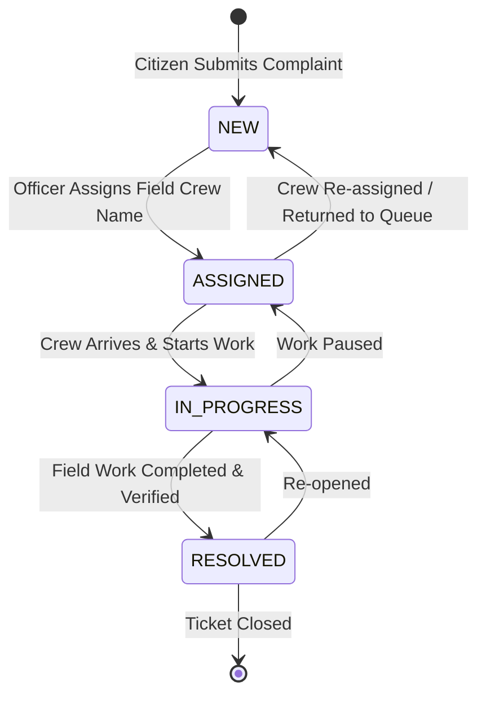

# Smart Civic Complaint & Issue Management System — Backend Architecture & Developer Guide

Welcome to the **Smart Civic Complaint & Issue Management System** backend documentation! This comprehensive guide is designed for developers, contributors, and municipal technical administrators who want to understand the complete inner workings, JWT authentication system, Role-Based Access Control (RBAC), algorithms, data flows, API specifications, and architecture of the system.

---

## 1. Executive Summary & Core Philosophy

The backend is built as a high-performance, asynchronous RESTful web service using **Python**, **FastAPI**, **Pydantic V2**, **PyJWT**, **bcrypt**, and **MongoDB**. It operates on a strict **Two-Role Access Control Model**: **Citizen** and **Municipal Officer**.

1. **Secure Role-Based Access Control (RBAC)**: Providing strict authorization boundaries between **Citizen** and **Municipal Officer** roles.
2. **Citizen Self-Registration & Issue Reporting**: Public self-registration (`Citizen` role), issue submission, tracking own complaints, adding comments, and local AI auto-classification.
3. **Municipal Officer Operations Queue**: Enabling Officers to view and manage all complaints, assign field crew/team names, update status workflows, view analytics, and seed test data.
4. **No Crew Account Requirement**: Field crews do not require login accounts; only assigned crew/team string names are stored on tickets.
5. **Rule-Based Issue Prioritization**: Dynamically scoring complaints based on urgency, age, category risk, and geographic cluster density.
6. **Service Level Agreement (SLA) Tracking**: Monitoring real-time resolution deadlines to prevent SLA breaches.
7. **Strict Workflow State Machine**: Enforcing valid operational transitions ($\text{NEW} \rightarrow \text{ASSIGNED} \rightarrow \text{IN\_PROGRESS} \rightarrow \text{RESOLVED}$).
8. **Municipal Operations Analytics**: Aggregating live database metrics for executive decision-making (restricted to Municipal Officers).
9. **Local AI / NLP Auto-Classification**: Automatically inferring categories, urgency, and summaries from raw citizen descriptions without external cloud API dependencies.

---

## 2. Tech Stack & Technologies

| Layer | Technology | Description |
| :--- | :--- | :--- |
| **Framework** | [FastAPI](https://fastapi.tiangolo.com/) (v0.110+) | Modern, fast web framework for building APIs with Python |
| **Authentication & RBAC**| [PyJWT](https://pyjwt.readthedocs.io/) & [bcrypt](https://pypi.org/project/bcrypt/) | Secure JWT token issuance & salt-hashed password authentication |
| **Data Validation** | [Pydantic V2](https://docs.pydantic.dev/) | Strict data parsing, type safety, and schema generation |
| **Database** | [MongoDB](https://www.mongodb.com/) / [PyMongo](https://pymongo.readthedocs.io/) | NoSQL document database for flexible JSON storage |
| **Database Mocking** | [Mongomock](https://github.com/mongomock/mongomock) | In-memory MongoDB mock fallback for seamless testing |
| **ASGI Server** | [Uvicorn](https://www.uvicorn.org/) | Lightning-fast ASGI server implementation |
| **Automated Testing**| [Pytest](https://docs.pytest.org/) | Comprehensive unit, integration, and RBAC security test runner |
| **API Testing** | [Postman](https://www.postman.com/) | Standard collection runner and manual test guide |

---

## 3. Project Directory Structure

```text
backend/
├── app/
│   ├── __init__.py             # Module initializer
│   ├── main.py                 # FastAPI application setup (Swagger disabled as requested)
│   ├── config.py               # Central settings (JWT secret, SLA hours, Category weights)
│   ├── database.py             # MongoDB connection manager & mongomock fallback
│   ├── schemas/
│   │   ├── complaint.py        # Complaint request & response schemas
│   │   └── user.py             # User registration, login & profile schemas
│   ├── services/
│   │   ├── auth_service.py     # JWT token decoding, bcrypt hashing & RBAC dependencies
│   │   ├── prioritization.py   # Dynamic priority scoring engine
│   │   ├── sla_service.py      # SLA status & deadline calculation logic
│   │   └── ai_service.py       # Local NLP text classification engine
│   └── routers/
│       ├── auth.py             # Citizen register, login & me profile endpoints
│       ├── complaints.py       # Role-protected complaint CRUD & workflow endpoints
│       ├── analytics.py        # Executive dashboard aggregation endpoints (Officer)
│       ├── ai.py               # NLP text classification utility endpoints
│       └── seed.py             # Sample dataset generator (Officer only)
├── tests/
│   └── test_api.py             # Comprehensive automated pytest suite (11 test suites)
├── main.py                     # Root application wrapper for `uvicorn main:app`
├── requirements.txt            # Python dependencies
├── POSTMAN_MANUAL_TEST_GUIDE.md# Step-by-step Postman manual testing guide
└── Civic_Complaint_Management_System.postman_collection.json # Updated Postman collection
```

---

## 4. Authentication & Role-Based Access Control (RBAC) Matrix

### User Roles & Privileges
1. **Citizen**:
   - Can register publicly (`POST /api/auth/register`).
   - Can login (`POST /api/auth/login`).
   - Can submit new civic complaints (`POST /api/complaints`).
   - Can view own reported complaints (`GET /api/complaints`).
   - Can add comments to complaints (`POST /api/complaints/{id}/comments`).
   - Can use AI text classifier (`POST /api/ai/classify`).
   - Cannot assign crew, update status, access municipal analytics, or seed DB.
2. **Municipal Officer**:
   - Pre-seeded or login account (`POST /api/auth/login`).
   - Can view, filter, and inspect full municipal complaint queue.
   - Can assign field crew/team names (`PATCH /api/complaints/{id}/assign`).
   - Can update complaint workflow status (`PATCH /api/complaints/{id}/status`).
   - Can view executive analytics dashboard (`GET /api/analytics`).
   - Can execute dataset seed (`POST /api/seed`).

### Master API Permission Reference

| Endpoint | Method | Allowed Roles | Unauthenticated | Citizen | Municipal Officer |
| :--- | :--- | :--- | :---: | :---: | :---: |
| `GET /` | `GET` | **Public** | `200` | `200` | `200` |
| `POST /api/auth/register` | `POST` | **Public (Citizen only)** | `201` | `201` | `400` |
| `POST /api/auth/login` | `POST` | **Public** | `200` | `200` | `200` |
| `GET /api/auth/me` | `GET` | `Citizen`, `Officer` | `401` | `200` | `200` |
| `POST /api/seed` | `POST` | `Officer` Only | `401` | `403` | `201` |
| `POST /api/complaints` | `POST` | `Citizen`, `Officer` | `401` | `201` | `201` |
| `GET /api/complaints` | `GET` | `Citizen` *(own)*, `Officer` *(all)* | `401` | `200` | `200` |
| `GET /api/complaints/{id}` | `GET` | `Citizen`, `Officer` | `401` | `200` | `200` |
| `PATCH /api/complaints/{id}/assign` | `PATCH` | `Officer` Only | `401` | `403` | `200` |
| `PATCH /api/complaints/{id}/status` | `PATCH` | `Officer` Only | `401` | `403` | `200` |
| `GET /api/complaints/{id}/comments` | `GET` | `Citizen`, `Officer` | `401` | `200` | `200` |
| `POST /api/complaints/{id}/comments` | `POST` | `Citizen`, `Officer` | `401` | `200` | `200` |
| `GET /api/analytics` | `GET` | `Officer` Only | `401` | `403` | `200` |
| `POST /api/ai/classify` | `POST` | `Citizen`, `Officer` | `401` | `200` | `200` |

---

## 5. Swagger UI Configuration

As requested ("Do not use Swagger"), FastAPI's interactive documentation endpoints (`/docs`, `/redoc`, `/openapi.json`) are completely disabled (`docs_url=None`, `redoc_url=None`, `openapi_url=None`). All API verification is conducted via automated Pytest or the Postman collection.

---

## 6. Advanced Routing & Lookup Features

1. **Flexible Trailing Slash Router Support**:
   - All router endpoints support both standard and trailing-slash URLs (e.g. `/api/analytics` and `/api/analytics/`, `/api/complaints` and `/api/complaints/`, `/api/seed` and `/api/seed/`), preventing 404 errors during client testing.

2. **Multi-Format Complaint Lookup**:
   - [`find_complaint_or_404`](file:///f:/DPA/backend/app/routers/complaints.py#L87) supports looking up complaints by:
     - 24-character hex MongoDB `ObjectId` (e.g. `66f41b2c3d4e5f6a7b8c9d0e`).
     - Full ticket number (e.g. `CIVIC-20260915-A1B2`).
     - Partial ticket code or hex suffix (e.g. `727070b7` or `A1B2`).

---

## 7. Operational Complaint Workflow State Machine

Complaints follow a strict linear lifecycle. The API rejects invalid state jumps (such as jumping directly from `NEW` to `RESOLVED` without being assigned or worked on).



---

## 8. Developer Onboarding & Running Tests

### Step 1: Navigate & Activate Virtual Environment
```powershell
cd f:\DPA\backend
.\venv\Scripts\Activate.ps1
```

### Step 2: Install Dependencies
```powershell
pip install -r requirements.txt
```

### Step 3: Run Automated Pytest Suite
```powershell
python -m pytest -v
```

### Step 4: Launch Development Server
```powershell
uvicorn main:app --reload --port 8000
```

---

## 9. Postman Testing Guide & Verification Status

All **Postman manual test cases** covering public health checks, JWT authentication, citizen self-registration, complaint reporting & ownership scoping, field crew assignment, workflow status updates, analytics, and security boundary assertions (`401` & `403` checks) have been fully verified.

Refer to [`POSTMAN_MANUAL_TEST_GUIDE.md`](file:///f:/DPA/backend/POSTMAN_MANUAL_TEST_GUIDE.md) for the step-by-step test runner sequence and JSON request payloads.
