# Smart Civic Complaint & Issue Management System — Comprehensive Postman Manual Testing Guide

This guide provides a complete, step-by-step manual testing procedure for every REST API endpoint in the **Smart Civic Complaint & Issue Management System** backend using **Postman**. 

It covers all three user roles (**Citizen**, **Municipal Officer**, **Field Crew**), authentication, state machine transitions, completion photo evidence, resolution verification, comments, analytics, AI classification, and Role-Based Access Control (RBAC) security boundaries.

---

## 1. Quick Reference: Pre-Seeded Default Test Accounts

The backend automatically seeds standard role accounts upon server startup or when executing the `/api/seed` endpoint:

| Role | Email | Password | Full Name / Details | Permissions |
| :--- | :--- | :--- | :--- | :--- |
| **Municipal Officer** | `officer@civic.gov` | `Officer123!` | Municipal Officer Dave | Full management, crew assignment, resolution verification, dataset seeding & analytics |
| **Field Crew** | `crew@civic.gov` | `Crew123!` | Arun Kumar (`CREW-101`) | Crew Portal access, Start Work, Complete Work photo evidence submission |
| **Citizen** | `citizen@civic.gov` | `Citizen123!` | Jane Citizen | Self-registration, issue reporting, tracking own complaints, adding comments |

---

## 2. Postman Environment Setup

In Postman, create an Environment named **Smart Civic Local** and define these variables:

| Variable Name | Initial Value | Description |
| :--- | :--- | :--- |
| `base_url` | `http://localhost:8000` | FastAPI server base URL |
| `citizen_token` | *(leave empty)* | Bearer token for Citizen role |
| `officer_token` | *(leave empty)* | Bearer token for Municipal Officer role |
| `crew_token` | *(leave empty)* | Bearer token for Field Crew role |
| `complaint_id` | *(leave empty)* | MongoDB `id` generated when creating a complaint |
| `ticket_number` | *(leave empty)* | Generated ticket number (e.g. `CIVIC-20260917-817D`) |

---

## 3. End-to-End Workflow Execution Order

Follow this exact sequential order to test the full system lifecycle:

```mermaid
flowchart TD
    S1["1. System Health Check (GET /)"] --> S2["2. Login Officer (POST /api/auth/login)"]
    S2 --> S3["3. Officer Seed Database (POST /api/seed)"]
    S3 --> S4["4. Login Field Crew (POST /api/auth/login)"]
    S4 --> S5["5. Register New Citizen (POST /api/auth/register)"]
    S5 --> S6["6. Login Citizen (POST /api/auth/login)"]
    S6 --> S7["7. Citizen Submit Complaint (POST /api/complaints)"]
    S7 --> S8["8. Citizen View Own Complaints (GET /api/complaints)"]
    S8 --> S9["9. Officer View All Complaints (GET /api/complaints)"]
    S9 --> S10["10. Officer Assign Crew (PATCH /api/complaints/{id}/assign)"]
    S10 --> S11["11. Crew Start Work (PATCH /api/complaints/{id}/status -> IN_PROGRESS)"]
    S11 --> S12["12. Crew Complete Work (PATCH /api/complaints/{id}/status -> COMPLETED)"]
    S12 --> S13["13. Officer Approve Resolution (PATCH /api/complaints/{id}/status -> RESOLVED)"]
    S13 --> S14["14. Citizen/Officer Add Comment (POST /api/complaints/{id}/comments)"]
    S14 --> S15["15. Fetch Audit History (GET /api/complaints/{id}/comments)"]
    S15 --> S16["16. Officer Analytics Dashboard (GET /api/analytics)"]
    S16 --> S17["17. AI Text Classification (POST /api/ai/classify)"]
    S17 --> S18["18. RBAC Security Boundary Tests (401 / 403 Tests)"]
```



---

## 4. Complete Test Cases & Requests

---

### PHASE 1: System & Authentication

#### Test Case 1: System Health Check
- **Method**: `GET`
- **URL**: `{{base_url}}/`
- **Headers**: None
- **Expected Status**: `200 OK`
- **Response Format**:
```json
{
  "status": "online",
  "service": "Smart Civic Complaint & Issue Management System",
  "database": "MongoDB (Active)",
  "rbac_enabled": true,
  "roles_supported": ["Citizen", "Municipal Officer", "Crew"]
}
```

---

#### Test Case 2: Login as Municipal Officer
- **Method**: `POST`
- **URL**: `{{base_url}}/api/auth/login`
- **Headers**:
  - `Content-Type: application/json`
- **Body (raw JSON)**:
```json
{
  "email": "officer@civic.gov",
  "password": "Officer123!"
}
```
- **Expected Status**: `200 OK`
- **Postman Script (Tests tab)**: Copy token into variable:
```javascript
var jsonData = pm.response.json();
pm.environment.set("officer_token", jsonData.access_token);
```

---

#### Test Case 3: Seed Sample Dataset (Officer Only)
- **Method**: `POST`
- **URL**: `{{base_url}}/api/seed`
- **Headers**:
  - `Authorization: Bearer {{officer_token}}`
- **Expected Status**: `201 Created`
- **Response**: Confirms database seeded with standard categories, test complaints, and accounts.

---

#### Test Case 4: Login as Field Crew
- **Method**: `POST`
- **URL**: `{{base_url}}/api/auth/login`
- **Headers**:
  - `Content-Type: application/json`
- **Body (raw JSON)**:
```json
{
  "email": "crew@civic.gov",
  "password": "Crew123!"
}
```
- **Expected Status**: `200 OK`
- **Postman Script (Tests tab)**:
```javascript
var jsonData = pm.response.json();
pm.environment.set("crew_token", jsonData.access_token);
```

---

#### Test Case 5: Register New Citizen Account
- **Method**: `POST`
- **URL**: `{{base_url}}/api/auth/register`
- **Headers**:
  - `Content-Type: application/json`
- **Body (raw JSON)**:
```json
{
  "email": "test.citizen@civic.gov",
  "password": "Citizen123!",
  "full_name": "Test Citizen User",
  "phone": "+1-555-0199",
  "role": "Citizen"
}
```
- **Expected Status**: `201 Created`

---

#### Test Case 6: Login as Citizen
- **Method**: `POST`
- **URL**: `{{base_url}}/api/auth/login`
- **Headers**:
  - `Content-Type: application/json`
- **Body (raw JSON)**:
```json
{
  "email": "citizen@civic.gov",
  "password": "Citizen123!"
}
```
- **Expected Status**: `200 OK`
- **Postman Script (Tests tab)**:
```javascript
var jsonData = pm.response.json();
pm.environment.set("citizen_token", jsonData.access_token);
```

---

#### Test Case 7: Get Current Authenticated Profile
- **Method**: `GET`
- **URL**: `{{base_url}}/api/auth/me`
- **Headers**:
  - `Authorization: Bearer {{citizen_token}}`
- **Expected Status**: `200 OK`

---

### PHASE 2: End-to-End Complaint Lifecycle (5-Stage State Machine)

#### Test Case 8: [STAGE 1: NEW] Citizen Submits Complaint
- **Method**: `POST`
- **URL**: `{{base_url}}/api/complaints`
- **Headers**:
  - `Content-Type: application/json`
  - `Authorization: Bearer {{citizen_token}}`
- **Body (raw JSON)**:
```json
{
  "category": "Streetlight",
  "description": "Streetlight near Gate 3 non-functional for one week. Road is extremely dark at night.",
  "location": "Central Park Gate 3, Balaji Nagar",
  "latitude": 13.0827,
  "longitude": 80.2707,
  "urgency": "High"
}
```
- **Expected Status**: `201 Created`
- **Postman Script (Tests tab)**:
```javascript
var jsonData = pm.response.json();
pm.environment.set("complaint_id", jsonData.id);
pm.environment.set("ticket_number", jsonData.ticket_number);
```

---

#### Test Case 9: Citizen View Own Complaints
- **Method**: `GET`
- **URL**: `{{base_url}}/api/complaints`
- **Headers**:
  - `Authorization: Bearer {{citizen_token}}`
- **Expected Status**: `200 OK`
- **Note**: Returns complaints submitted by the authenticated citizen.

---

#### Test Case 10: Officer View All Complaints Queue
- **Method**: `GET`
- **URL**: `{{base_url}}/api/complaints?status=New`
- **Headers**:
  - `Authorization: Bearer {{officer_token}}`
- **Expected Status**: `200 OK`

---

#### Test Case 11: [STAGE 2: ASSIGNED] Officer Assigns Crew
- **Method**: `PATCH`
- **URL**: `{{base_url}}/api/complaints/{{complaint_id}}/assign`
- **Headers**:
  - `Content-Type: application/json`
  - `Authorization: Bearer {{officer_token}}`
- **Body (raw JSON)**:
```json
{
  "assigned_to": "Electrical Team - North Zone",
  "assigned_crew_id": "CREW-101",
  "note": "Assigned to Electrical Team for immediate field inspection."
}
```
- **Expected Status**: `200 OK`
- **Verified Fields**: `status: "Assigned"`, `assigned_crew_id: "CREW-101"`.

---

#### Test Case 12: [STAGE 3: IN_PROGRESS] Crew Clicks Start Work
- **Method**: `PATCH`
- **URL**: `{{base_url}}/api/complaints/{{complaint_id}}/status`
- **Headers**:
  - `Content-Type: application/json`
  - `Authorization: Bearer {{crew_token}}`
- **Body (raw JSON)**:
```json
{
  "status": "IN_PROGRESS",
  "note": "Crew arrived on site and started repairing fixture."
}
```
- **Expected Status**: `200 OK`
- **Verified Fields**: `status: "In Progress"` (or `IN_PROGRESS`), `started_at` timestamp recorded.

---

#### Test Case 13: [STAGE 4: COMPLETED] Crew Submits Completion Evidence Photo & Note
- **Method**: `PATCH`
- **URL**: `{{base_url}}/api/complaints/{{complaint_id}}/status`
- **Headers**:
  - `Content-Type: application/json`
  - `Authorization: Bearer {{crew_token}}`
- **Body (raw JSON)**:
```json
{
  "status": "COMPLETED",
  "completion_photo": "https://storage.civic.gov/evidence/comp-827F.jpg",
  "completion_note": "Replaced damaged LED luminaire fixture and restored power circuit."
}
```
- **Expected Status**: `200 OK`
- **Verified Fields**: `status: "Completed"`, `completion_photo`, `completion_note`, `completed_at` timestamp recorded.

---

#### Test Case 14: [STAGE 5: RESOLVED] Officer Approves Completion & Resolves Issue
- **Method**: `PATCH`
- **URL**: `{{base_url}}/api/complaints/{{complaint_id}}/status`
- **Headers**:
  - `Content-Type: application/json`
  - `Authorization: Bearer {{officer_token}}`
- **Body (raw JSON)**:
```json
{
  "status": "RESOLVED",
  "note": "Inspected photo evidence and verified physical repair. Issue resolved."
}
```
- **Expected Status**: `200 OK`
- **Verified Fields**: `status: "Resolved"`, `resolved_at`, `verified_by: "Municipal Officer Dave"`.

---

#### Test Case 15: [REWORK FLOW] Officer Rejects Evidence & Sends Back to Crew
*(Optional Rework Workflow Test)*
- **Method**: `PATCH`
- **URL**: `{{base_url}}/api/complaints/{{complaint_id}}/status`
- **Headers**:
  - `Content-Type: application/json`
  - `Authorization: Bearer {{officer_token}}`
- **Body (raw JSON)**:
```json
{
  "status": "IN_PROGRESS",
  "note": "Completion photo is blurry. Please provide clear photo proof of sealed post."
}
```
- **Expected Status**: `200 OK`
- **Verified Fields**: Status transitions back to `In Progress` for crew rework.

---

### PHASE 3: Audit Trail Comments & Analytics

#### Test Case 16: Add Comment to Complaint
- **Method**: `POST`
- **URL**: `{{base_url}}/api/complaints/{{complaint_id}}/comments`
- **Headers**:
  - `Content-Type: application/json`
  - `Authorization: Bearer {{citizen_token}}`
- **Body (raw JSON)**:
```json
{
  "author": "Jane Citizen",
  "content": "Thank you for fixing the light so quickly!"
}
```
- **Expected Status**: `200 OK`

---

#### Test Case 17: Fetch Complaint Comments & History
- **Method**: `GET`
- **URL**: `{{base_url}}/api/complaints/{{complaint_id}}/comments`
- **Headers**:
  - `Authorization: Bearer {{citizen_token}}`
- **Expected Status**: `200 OK`

---

#### Test Case 18: Get Operations Dashboard Analytics (Officer Only)
- **Method**: `GET`
- **URL**: `{{base_url}}/api/analytics`
- **Headers**:
  - `Authorization: Bearer {{officer_token}}`
- **Expected Status**: `200 OK`
- **Expected Response**: Returns aggregated complaint totals by status, category breakdown, resolution performance metrics, and zone statistics.

---

#### Test Case 19: AI NLP Issue Classification
- **Method**: `POST`
- **URL**: `{{base_url}}/api/ai/classify`
- **Headers**:
  - `Content-Type: application/json`
  - `Authorization: Bearer {{citizen_token}}`
- **Body (raw JSON)**:
```json
{
  "text": "Deep pothole in the middle lane causing tire damage near KK Nagar main junction."
}
```
- **Expected Status**: `200 OK`
- **Response**:
```json
{
  "category": "Road",
  "urgency": "High",
  "location": "KK Nagar",
  "summary": "Pothole reported near KK Nagar.",
  "original_text": "Deep pothole in the middle lane causing tire damage near KK Nagar main junction."
}
```

---

### PHASE 4: Security & RBAC Boundary Tests (401 & 403 Scenarios)

| # | Test Scenario | Endpoint | Token Used | Expected Code | Expected Error Message |
| :--- | :--- | :--- | :--- | :---: | :--- |
| **20** | **Unauthenticated Access** | `GET /api/auth/me` | *None* | `401 Unauthorized` | `"Authentication token is missing or invalid."` |
| **21** | **Invalid Bearer Token** | `GET /api/complaints` | `Bearer invalid_jwt` | `401 Unauthorized` | `"Invalid authentication token."` |
| **22** | **Citizen Access to Seed** | `POST /api/seed` | `citizen_token` | `403 Forbidden` | `"Access forbidden: Operation requires one of roles ['Municipal Officer']."` |
| **23** | **Citizen Assign Crew** | `PATCH /api/complaints/{id}/assign` | `citizen_token` | `403 Forbidden` | `"Access forbidden: Operation requires one of roles ['Municipal Officer']."` |
| **24** | **Citizen View Analytics** | `GET /api/analytics` | `citizen_token` | `403 Forbidden` | `"Access forbidden: Operation requires one of roles ['Municipal Officer']."` |
| **25** | **Crew Access to Seed** | `POST /api/seed` | `crew_token` | `403 Forbidden` | `"Access forbidden: Operation requires one of roles ['Municipal Officer']."` |

---

## 5. Summary Matrix of Roles & Permissions

| Endpoint | Method | Public | Citizen | Crew | Municipal Officer |
| :--- | :--- | :---: | :---: | :---: | :---: |
| `GET /` | `GET` | ✅ | ✅ | ✅ | ✅ |
| `POST /api/auth/register` | `POST` | ✅ *(Citizen only)* | ✅ | ✅ | ✅ |
| `POST /api/auth/login` | `POST` | ✅ | ✅ | ✅ | ✅ |
| `GET /api/auth/me` | `GET` | ❌ | ✅ | ✅ | ✅ |
| `POST /api/seed` | `POST` | ❌ | ❌ | ❌ | ✅ |
| `POST /api/complaints` | `POST` | ❌ | ✅ | ✅ | ✅ |
| `GET /api/complaints` | `GET` | ❌ | ✅ *(Own)* | ✅ *(Assigned)* | ✅ *(All)* |
| `GET /api/complaints/{id}` | `GET` | ❌ | ✅ | ✅ | ✅ |
| `PATCH /api/complaints/{id}/assign` | `PATCH` | ❌ | ❌ | ❌ | ✅ |
| `PATCH /api/complaints/{id}/status` | `PATCH` | ❌ | ❌ | ✅ *(Crew lifecycle)* | ✅ *(Full lifecycle)* |
| `GET /api/complaints/{id}/comments` | `GET` | ❌ | ✅ | ✅ | ✅ |
| `POST /api/complaints/{id}/comments` | `POST` | ❌ | ✅ | ✅ | ✅ |
| `GET /api/analytics` | `GET` | ❌ | ❌ | ❌ | ✅ |
| `POST /api/ai/classify` | `POST` | ❌ | ✅ | ✅ | ✅ |
