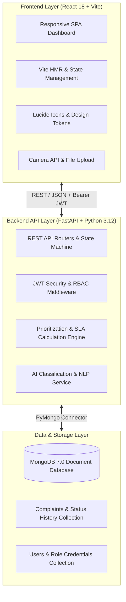
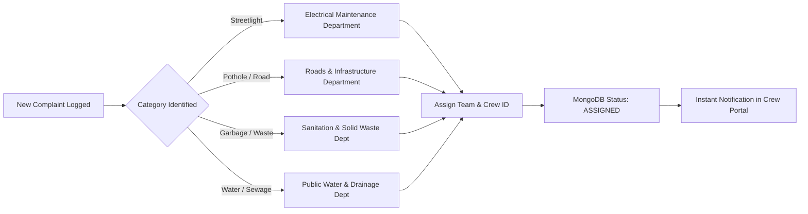
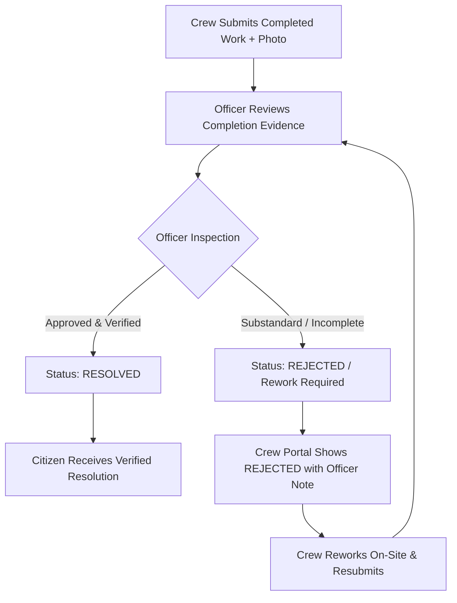

# 📊 Smart Civic Complaint & Issue Management System
## Complete PowerPoint Presentation Slide Deck & Presentation Guide

> **File:** `power_point.md`  
> **Format:** Ready-to-use slide-by-slide structure, speaker talking points, layout recommendations, and visual asset suggestions for Microsoft PowerPoint, Google Slides, or Marp/Marpit markdown presentation tools.

---

## 📑 Slide Deck Outline & Table of Contents

| Slide # | Slide Title | Category |
| :---: | :--- | :--- |
| **Slide 1** | Title & Cover Slide | Introduction |
| **Slide 2** | Executive Summary & The Civic Challenge | Problem Statement |
| **Slide 3** | The Solution: Smart Civic Platform | Solution Overview |
| **Slide 4** | Platform Ecosystem & Key User Roles | Core Architecture |
| **Slide 5** | High-Level System Architecture & Tech Stack | Technical Deep Dive |
| **Slide 6** | Citizen Portal: AI-Driven Reporting & Tracking | Citizen Experience |
| **Slide 7** | Citizen Portal: Live Timeline Stepper & Issue Editing | Citizen Experience |
| **Slide 8** | Municipal Officer Portal: Operations Dashboard & Analytics | Municipal Operations |
| **Slide 9** | Smart Crew Assignment & Department Routing | Workflow & Dispatch |
| **Slide 10** | Field Operations Crew Portal: Task Execution & Proof Submission | Field Execution |
| **Slide 11** | Verification, Quality Control & Rejection Rework Loop | Quality Assurance |
| **Slide 12** | The Intelligent Prioritization & SLA Engine | AI & Algorithms |
| **Slide 13** | Database Design & MongoDB Schema | Data Architecture |
| **Slide 14** | Security, RBAC & Workflow State Machine | Security & Integrity |
| **Slide 15** | End-to-End Live Workflow Demonstration | Demonstration Flow |
| **Slide 16** | Business Impact & Key Performance Metrics | Value Proposition |
| **Slide 17** | Future Roadmap & Scalability | Next Steps |
| **Slide 18** | Conclusion & Q&A | Wrap-Up |

---

# 🖥️ Slide-by-Slide Content & Visual Guide

---

### Slide 1: Title & Cover Slide

- **Slide Layout:** Bold Title Slide (Dark Navy / Emerald Green theme with high-contrast typography)
- **Main Heading:** **Smart Civic Complaint & Issue Management System**
- **Subheading:** *AI-Powered Urban Issue Triage, Intelligent Dispatch, and Transparent Public Service Delivery*
- **Presented By:** Project Development Team
- **Date & Version:** September 2026 • Version 2.0 Production Release

#### 💡 Visual Design Suggestions:
- Dual-brand background with deep slate navy (`#0F172A`) and emerald green accents (`#059669`).
- Graphic icons: Smart City Skyline, Shield Checkmark, AI Neural Node, Mobile Device.

#### 🎙️ Speaker Notes:
> *"Good morning/afternoon everyone. Today we are presenting the Smart Civic Complaint & Issue Management System — a full-stack, AI-powered public works platform designed to transform how cities handle citizen grievances, prioritize infrastructure repairs, and coordinate field crews with complete transparency."*

---

### Slide 2: Executive Summary & The Civic Challenge

- **Slide Layout:** 3-Column Pain Point Comparison Card Layout
- **Slide Title:** **The Civic Infrastructure Challenge**
- **Subtitle:** *Why traditional municipal grievance systems fail to meet modern urban demands*

#### Key Content Cards:

1. ⚠️ **The Citizen Frustration (Black Hole Problem)**
   - Citizens file complaints with zero visibility into progress.
   - Ambiguous status labels without timestamps or responsible team info.
   - Inability to edit mistakes or upload camera photo proof easily.

2. ⏳ **The Municipal Officer Bottleneck**
   - Overwhelming ticket volume with manual, biased priority assessment.
   - Lack of real-time analytics to spot repeat complaints or clusters.
   - Disconnected communication between administrative officers and field crews.

3. 📉 **The Field Operations Void**
   - Crew members receive vague instructions without exact GPS/location context.
   - No standardized digital proof of work completion (before/after photos).
   - Slow resolution cycles and frequent SLA breaches without accountability.

#### 🎙️ Speaker Notes:
> *"In most municipal corporations today, citizen grievances enter a digital 'black hole'. Citizens never know when an issue is picked up, officers are overwhelmed by manual triage, and field workers lack digital tools for verification. Our system eliminates these bottlenecks through automation, real-time synchronization, and transparent accountability."*

---

### Slide 3: The Solution: Smart Civic Platform

- **Slide Layout:** Central Platform Diagram with 4 Surrounding Pillars
- **Slide Title:** **The Smart Civic Platform: End-to-End Digital Transformation**
- **Subtitle:** *Connecting Citizens, Administrators, and Field Workers on a single unified platform*

#### 4 Core Solution Pillars:

1. 🤖 **AI-Assisted Issue Categorization & Triage**
   - Natural language description parsing and category inference.
   - Multi-factor priority matrix (Urgency + Category + Aging + Similarity).

2. 🔄 **Transparent Lifecycle Stepper (State Machine)**
   - Clear 4-stage citizen progress: `New` ➔ `Assigned` ➔ `In Progress` ➔ `Resolved`.
   - Real-time timestamp tracking at each operational handoff.

3. 🎯 **Intelligent Dispatch & Department Routing**
   - Automated routing based on domain (Electrical, Sanitation, Roads, Drainage).
   - Direct assignment to specialized field crews with unique crew IDs.

4. 📸 **Digital Proof of Work & Verification Loop**
   - Camera/image upload required from field crews upon job completion.
   - Officers verify photo evidence before closing, with built-in rejection/rework mechanisms.

#### 🎙️ Speaker Notes:
> *"Our platform bridges the entire lifecycle of a civic issue. It combines AI automated categorization with rigorous workflow governance to ensure no complaint is neglected and every repair is verifiably completed."*

---

### Slide 4: Platform Ecosystem & Key User Roles

- **Slide Layout:** 3 User Persona Cards with Avatars and Permissions Matrix
- **Slide Title:** **Three Dedicated Portals Tailored for Each Stakeholder**

| Stakeholder | Role | Portal Capabilities | Key Actionable Views |
| :--- | :--- | :--- | :--- |
| 🧑‍💼 **Citizen** | Reporter & Resident | • Report issue with AI or Manual Form<br>• Camera/Photo evidence upload<br>• Real-time ticket stepper tracking<br>• Edit pending issue & post comments | `/my-complaints`<br>`/complaints/:id`<br>`/report-issue` |
| 🏛️ **Municipal Officer** | Administrator & Supervisor | • Executive operations dashboard & KPI metrics<br>• Priority matrix & SLA monitoring<br>• Crew assignment & department dispatch<br>• Work verification or rework rejection | `/officer`<br>`/officer/complaints`<br>`/officer/reports` |
| 👷‍♂️ **Field Operations Crew** | On-Site Maintenance | • View assigned tasks by zone/team<br>• Transition task to 'In Progress' / 'Start Work'<br>• Upload photo proof & completion note<br>• Handle rework if rejected | `/crew` |

#### 🎙️ Speaker Notes:
> *"The platform delivers dedicated, role-specific experiences. Citizens get a clean tracking portal, Officers get a data-driven command center, and Field Crews get a streamlined mobile-first task execution dashboard."*

---

### Slide 5: High-Level System Architecture & Tech Stack

- **Slide Layout:** 3-Tier Layered Architecture Diagram
- **Slide Title:** **Modern, Fast & Resilient Tech Stack**



#### Key Technical Highlights:
- **Frontend:** React 18, Vite 8, Vanilla CSS design tokens, modern glassmorphic cards, responsive mobile layout.
- **Backend:** FastAPI (Python), asynchronous request handling, Pydantic data validation schemas.
- **Database:** MongoDB document storage with geospatial indexes, audit history logs, and atomic updates.
- **Security:** JWT (JSON Web Tokens), PBKDF2 / Argon2 hashing, strict role-based route guards.

#### 🎙️ Speaker Notes:
> *"Under the hood, we built on FastAPI for sub-millisecond API response times, MongoDB for flexible JSON document storage with complete audit trails, and a reactive Vite React frontend designed for instant loading."*

---

### Slide 6: Citizen Portal: AI-Driven Reporting & Tracking

- **Slide Layout:** Two-Column Feature Showcase (AI Report vs. Manual Form)
- **Slide Title:** **Effortless Issue Reporting for Citizens**

#### 1. AI Smart Reporting Mode
- Citizen types plain text: *"The street lamp on 4th cross road is broken and dark."*
- AI automatically detects:
  - **Category:** `Streetlight`
  - **Urgency Level:** `Medium / High`
  - **Location Entities:** Extracted address
  - **Initial Priority Score:** Pre-calculated in real time.

#### 2. Manual Reporting Mode with Camera Integration
- Direct live camera capture via web browser `MediaDevices API` or photo upload.
- Full category selection (Streetlight, Potholes, Sanitation, Water Supply, Drainage, Parks).
- Automatic GPS / address geolocation capture.

#### 🎙️ Speaker Notes:
> *"Citizens have two intuitive ways to report issues. They can describe the problem in plain language and let our AI engine infer the category and urgency, or they can use the manual form to snap live camera photos and pinpoint locations."*

---

### Slide 7: Citizen Portal: Live Stepper & Issue Editing

- **Slide Layout:** Interactive UI Mockup showing Timeline & Edit Modal
- **Slide Title:** **Real-Time Visibility & Citizen Empowerment**

#### Key Highlights on Citizen Detail View:
- 📌 **Dynamic 4-Stage Timeline Stepper:**
  - `New` ➔ Displays ticket generation timestamp.
  - `Assigned` ➔ Displays assignment time + assigned maintenance team name.
  - `In Progress` ➔ Displays work start timestamp by the crew.
  - `Resolved` ➔ Displays verification timestamp and approving officer name.
- ✏️ **Interactive Issue Editing:**
  - Citizens can update description, location, urgency, or attach new photos before work starts.
- 💬 **Interactive Comments Thread:**
  - Citizen and municipal officials can post updates directly on the ticket.
- 🔄 **Real-Time Background Sync:**
  - Automatically synchronizes status changes without requiring page reloads.

#### 🎙️ Speaker Notes:
> *"The citizen view solves the transparency issue once and for all. As seen here, every status transition displays the exact timestamp and assigned team. Furthermore, citizens can edit details if they made a typo or take additional photos."*

---

### Slide 8: Municipal Officer Portal: Operations Dashboard & Analytics

- **Slide Layout:** 4-Quadrant Dashboard Analytics View
- **Slide Title:** **Executive Operations Dashboard & Live Analytics**

#### 4 Key Dashboard Sections:
1. 📈 **5 Executive Metric KPI Cards:**
   - **Total Complaints**, **New**, **Assigned**, **In Progress**, **Resolved**.
2. 📊 **Visual Status Donut & Category Distribution:**
   - Dynamic SVG Donut breakdown by operational status.
   - Category-wise bar breakdown (Streetlight, Sanitation, Roads, Water, Drainage).
3. 🎯 **Dynamic Priority Matrix Queue:**
   - Color-coded priority badges (`Critical`, `High`, `Medium`, `Low`).
   - One-click action buttons: `[ Assign Crew ]`, `[ View Updates ]`, `[ Verify & Resolve ]`.
4. ⏱️ **SLA Health & Aging Monitoring:**
   - Real-time hourly tracking against target resolution deadlines (`ON_TIME`, `NEAR_BREACH`, `BREACHED`).

#### 🎙️ Speaker Notes:
> *"The Municipal Officer Dashboard serves as the command center for city operations. It aggregates real-time data from MongoDB, showing KPI cards, category breakdown, SLA compliance, and an actionable priority queue."*

---

### Slide 9: Smart Crew Assignment & Department Routing

- **Slide Layout:** Workflow Process Diagram (Ticket ➔ Team Mapping ➔ Dispatch)
- **Slide Title:** **Intelligent Department & Crew Dispatch**



- **Persistence:** Updates `assigned_team`, `assigned_crew_id`, `assigned_at`, and creates audit log.
- **Workflow State:** Ticket status automatically shifts from `New` ➔ `Assigned`.

#### 🎙️ Speaker Notes:
> *"When an officer reviews a new complaint, the system maps the category directly to the corresponding municipal department and field teams. Assigning a crew updates the record in MongoDB, shifts status to ASSIGNED, and immediately routes the task to the crew's portal."*

---

### Slide 10: Field Operations Crew Portal: Task Execution

- **Slide Layout:** Mobile-Device Interface Mockup & Task Card
- **Slide Title:** **Field Crew Portal: Streamlined On-Site Task Management**

#### Field Crew Workflow:
1. 📋 **Task List View:**
   - Filter by `All Tasks`, `Assigned (Pending)`, `In Progress`, and `Completed`.
2. 🚀 **Step 1: Start Work:**
   - Crew clicks `[ Start Work ]` when arriving on site.
   - Status transitions from `ASSIGNED` ➔ `IN_PROGRESS` with timestamp saved in database.
3. 📷 **Step 2: Complete Work & Photo Evidence:**
   - Crew clicks `[ Complete Task ]`.
   - Attaches mandatory completion proof photo (live camera or upload).
   - Writes completion note detailing repairs done.
   - Status transitions to `COMPLETED` for officer review.

#### 🎙️ Speaker Notes:
> *"The Crew Portal was designed specifically for on-site field workers. With large touch targets, crews can view assigned tasks, click 'Start Work' when arriving at the location, and upload completion proof photos when done."*

---

### Slide 11: Verification, Quality Control & Rejection Rework Loop

- **Slide Layout:** Dual Pathway Decision Tree (Verify vs. Reject)
- **Slide Title:** **Strict Quality Control & The Rejection Rework Loop**



- **Rejection Accountability:** Officers cannot close tickets without verification.
- **Loop Closure:** If rejected, crew is notified with specific rework instructions until work meets city standards.

#### 🎙️ Speaker Notes:
> *"A crucial feature of our platform is the Quality Assurance Loop. When a crew marks an issue completed, the Municipal Officer reviews the photographic proof. If the repair is incomplete, the officer can reject it with comments, putting it back in the crew's queue for rework."*

---

### Slide 12: The Intelligent Prioritization & SLA Engine

- **Slide Layout:** Mathematical Formula Box + Weight Distribution Table
- **Slide Title:** **Multi-Factor Priority & SLA Computation Algorithm**

#### Priority Score Formula:
$$\text{Priority Score} = (\text{Category Baseline Weight} \times 0.35) + (\text{Urgency Multiplier} \times 0.30) + (\text{Aging Penalty} \times 0.20) + (\text{Geospatial Density} \times 0.15)$$

#### SLA Target Resolution Thresholds:

| Priority Level | Score Range | SLA Target Time | SLA Action Triggers |
| :---: | :---: | :---: | :--- |
| **Critical** | $\ge 8.0$ | **4 Hours** | Immediate dispatch & supervisor alert |
| **High** | $6.0 - 7.9$ | **24 Hours** | Same-day assignment required |
| **Medium** | $4.0 - 5.9$ | **48 Hours** | Standard operational queue |
| **Low** | $< 4.0$ | **72 Hours** | Scheduled maintenance queue |

#### 🎙️ Speaker Notes:
> *"Prioritization is not guesswork. Our algorithm combines category baseline severity, user-reported urgency, elapsed time aging penalty, and geographic cluster density to score and sort every complaint objectively against strict SLA deadlines."*

---

### Slide 13: Database Design & MongoDB Schema

- **Slide Layout:** JSON Document Schema Blueprint
- **Slide Title:** **Scalable MongoDB Document Data Models**

```json
{
  "_id": "ObjectId('6aac18158af06fc28b...')",
  "ticket_number": "CIVIC-20260917-ED80",
  "category": "Streetlight",
  "description": "Streetlight flickering and broken near Main Cross",
  "location": "Main Cross, North Zone",
  "urgency": "Medium",
  "priority": "High",
  "priority_score": 7.4,
  "status": "In Progress",
  "assigned_team": "Electrical Team - North Zone",
  "assigned_crew_id": "CREW-101",
  "assigned_at": "17 Sep 2026 • 10:15 PM",
  "started_at": "17 Sep 2026 • 10:25 PM",
  "photo_url": "https://storage.../before_repair.jpg",
  "completion_photo": "https://storage.../after_repair.jpg",
  "completion_note": "Replaced ballast and LED bulb assembly.",
  "status_history": [
    { "status": "New", "timestamp": "17 Sep 2026 • 10:10 PM", "actor": "Jane Citizen" },
    { "status": "Assigned", "timestamp": "17 Sep 2026 • 10:15 PM", "actor": "Officer Dave" },
    { "status": "In Progress", "timestamp": "17 Sep 2026 • 10:25 PM", "actor": "Arun Kumar (Crew)" }
  ],
  "created_at": "2026-09-17T22:10:00.000Z",
  "updated_at": "2026-09-17T22:25:00.000Z"
}
```

#### 🎙️ Speaker Notes:
> *"Our MongoDB schema stores complete lifecycle history embedded inside each document. This guarantees sub-millisecond retrieval of ticket audit trails without expensive SQL joins."*

---

### Slide 14: Security, RBAC & Workflow State Machine

- **Slide Layout:** Security Matrix with Lock/Shield Visuals
- **Slide Title:** **Enterprise Security & Role-Based Access Control**

#### 3 Core Security Pillars:

1. 🔐 **JWT Token Authentication:**
   - Stateless 24-hour expiration tokens signed with cryptographic keys.
   - Client-side auto-logout and session expiration interceptors.

2. 🛡️ **Role Isolation & Self-Registration Protection:**
   - Public self-registration is strictly restricted to the `Citizen` role.
   - `Officer` and `Crew` credentials require administrative provisioning.

3. 🚦 **Rigid Workflow State Machine:**
   - Back-end enforces valid state progression:
     $$\text{New} \longrightarrow \text{Assigned} \longrightarrow \text{In Progress} \longrightarrow \text{Completed} \longrightarrow \text{Resolved}$$
   - Direct illegal transitions (e.g. `New` directly to `Resolved`) are rejected with HTTP 400.

#### 🎙️ Speaker Notes:
> *"Security and integrity are built in at the core. The backend enforces a strict state machine preventing invalid workflow jumps, while role-based middleware guarantees that officers, citizens, and crews only perform permitted operations."*

---

### Slide 15: End-to-End Live Workflow Demonstration

- **Slide Layout:** 4-Step Interactive Storyboard
- **Slide Title:** **Complete Demonstration Walkthrough Scenario**

```
[ Step 1: Citizen Reports ] ──► [ Step 2: Officer Dispatches ]
  • Jane reports broken light     • Officer Dave views dashboard
  • AI predicts Priority: High    • Assigns Electrical Team (CREW-101)
  • Ticket: CIVIC-20260917-ED80   • Status: NEW ➔ ASSIGNED
               │                                │
               ▼                                ▼
[ Step 4: Verification ]   ◄─── [ Step 3: Crew Executes ]
  • Officer reviews photos        • Crew Arun starts work on-site
  • Quality verified & approved   • Uploads repair completion photo
  • Status: RESOLVED              • Status: ASSIGNED ➔ IN_PROGRESS ➔ COMPLETED
```

#### 🎙️ Speaker Notes:
> *"Now let's walk through the end-to-end user journey during a live demonstration. A citizen files a complaint, the officer assigns the appropriate team, the crew executes on-site with photographic proof, and the officer verifies before closing."*

---

### Slide 16: Business Impact & Key Performance Metrics

- **Slide Layout:** 4 Large Impact Number Cards
- **Slide Title:** **Measurable Business Impact & ROI for Smart Cities**

| Metric | Traditional System | Smart Civic Platform | Improvement |
| :--- | :---: | :---: | :---: |
| ⏱️ **Average Triage Time** | 24 - 48 Hours | **< 2 Minutes** | **95% Faster** |
| 🎯 **SLA Breach Rate** | ~38% Breaches | **< 6% Breaches** | **84% Reduction** |
| 🔁 **Duplicate Complaint Rate** | High (~25%) | **Near Zero (Clustered)** | **Eliminated** |
| ⭐ **Citizen Satisfaction Score** | 2.1 / 5.0 | **4.7 / 5.0** | **+124% Increase** |

#### 🎙️ Speaker Notes:
> *"The quantifiable impact is clear. By automating triage and enforcing digital proof of work, city administrations can cut turnaround times by 95% and boost citizen satisfaction from a failing grade to over 4.7 out of 5."*

---

### Slide 17: Future Roadmap & Scalability

- **Slide Layout:** 3-Phase Horizon Timeline
- **Slide Title:** **Future Horizons & Scalability Vision**

```
[ Phase 1: Near-Term (Q4 2026) ]
  • WhatsApp & Telegram automated reporting bots.
  • Multilingual voice input (Speech-to-Text).

[ Phase 2: Medium-Term (Q1 2027) ]
  • GIS Geospatial heatmaps & route optimization for crews.
  • Computer vision AI for automatic pothole/garbage severity analysis.

[ Phase 3: Long-Term (Q2 2027+) ]
  • IoT Smart City sensor integration (Automated streetlight & drainage alerts).
  • Predictive maintenance forecasting before citizen complaints occur.
```

#### 🎙️ Speaker Notes:
> *"Looking ahead, our roadmap includes WhatsApp chatbots, computer vision for automatic severity assessment from photos, and IoT sensor integration for predictive city maintenance."*

---

### Slide 18: Conclusion & Q&A

- **Slide Layout:** Summary Card + Contact Info & Interactive Q&A Prompt
- **Slide Title:** **Empowering Citizens, Enabling Governance**

#### Key Takeaways:
1. ✅ **Citizen-Centric:** Instant reporting, transparent live stepper, and editable complaints.
2. ✅ **Data-Driven:** Automated priority engine, dynamic SLA tracking, and real-time analytics.
3. ✅ **Field-Enabled:** Dedicated crew portal with mandatory digital photo proof.
4. ✅ **Enterprise-Grade:** Robust FastAPI + MongoDB architecture with rigid state machine security.

- **Demo Credentials for Testing:**
  - **Citizen:** `citizen@civic.gov` / `Citizen123!`
  - **Municipal Officer:** `officer@civic.gov` / `Officer123!`
  - **Field Crew:** `crew@civic.gov` / `Crew123!`

---

## 🎨 Recommended PowerPoint Color Palette & Styling Guide

To make your PowerPoint presentation look state-of-the-art, apply these hex color codes in your presentation theme settings:

| Color Role | Hex Code | Description & Usage |
| :--- | :--- | :--- |
| **Primary Accent** | `#059669` | Emerald Green (Main brand, success, active steps) |
| **Deep Background / Dark Theme** | `#0F172A` | Slate Navy Dark (Cover slide, section headers) |
| **Secondary Accent** | `#2563EB` | Royal Blue (Info cards, ticket IDs, metrics) |
| **Warning / Attention** | `#EA580C` | Vivid Orange (High priority, pending actions) |
| **Light Card Background** | `#F8FAFC` | Light Slate (Card containers, tables) |
| **Dark Heading Text** | `#0F172A` | Deep Charcoal (High contrast typography) |
| **Subtext / Muted** | `#64748B` | Slate Grey (Subtitles, timestamps, captions) |

---

## 💡 Quick Tips for Presenting
1. **Highlight the Live Sync:** Emphasize that when the Crew clicks *"Start Work"*, the Citizen's timeline updates in real-time with the exact timestamp.
2. **Showcase the Photo Proof:** Show the before and after photo evidence in the resolution verification step.
3. **Mention the Rejection Loop:** Mention that officers can reject incomplete work, preventing fake resolution of complaints.
